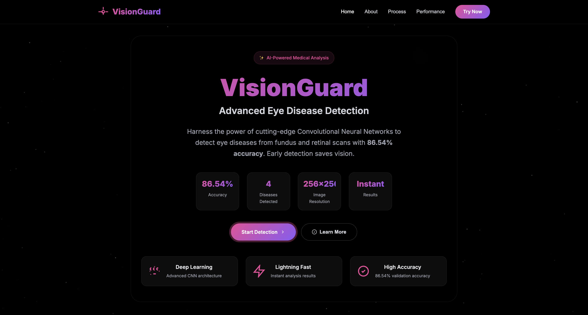
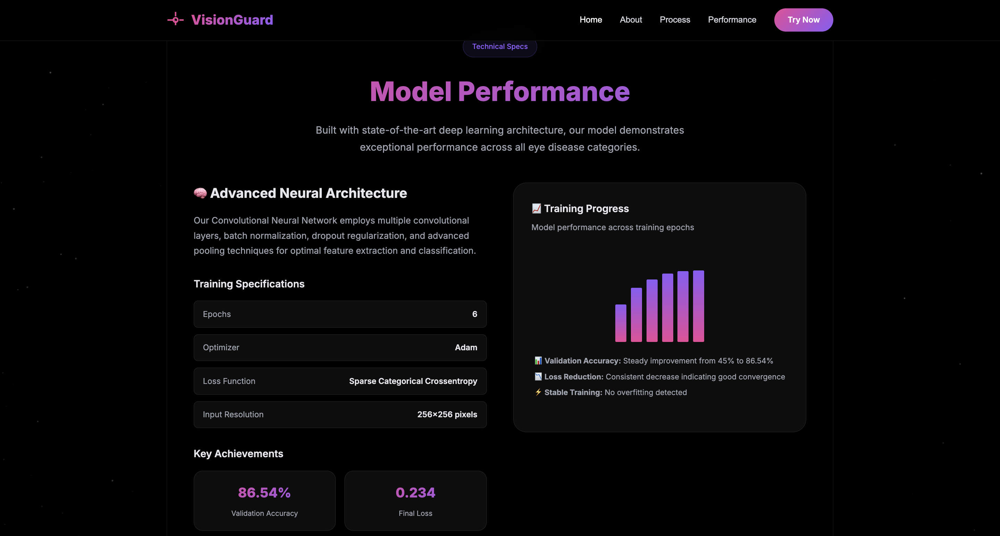
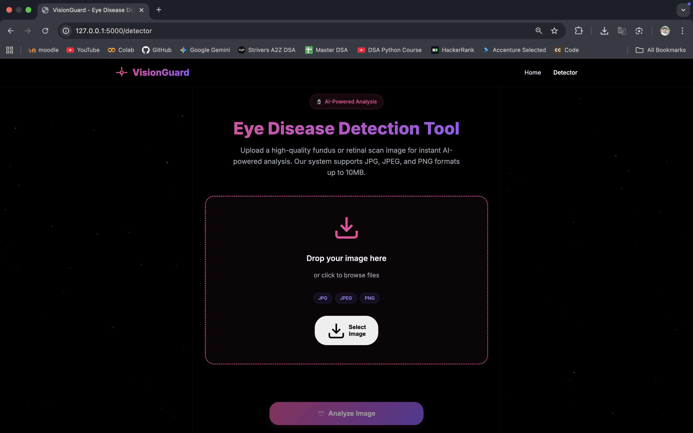

## VisionGuard: AI-Powered Eye Disease Detection

VisionGuard leverages cutting-edge deep learning techniques to assist in the early detection of eye diseases using medical images. The project is primarily built in Python and Jupyter Notebook, with a Flask backend serving as the main driver for both API endpoints and front-end integration.

### Key Features

- **Convolutional Neural Network (CNN) Model:**  
  The heart of VisionGuard is a custom-trained CNN designed to classify and detect eye diseases from retinal images with high accuracy. The model utilizes advanced preprocessing and augmentation techniques for robust performance.

- **Flask Backend as the Heavylifter:**  
  All user interactions and requests are routed through a Flask application, which manages image uploads, model inference, and serves dynamic content. Flask handles the integration of the AI model and acts as the backbone for the front end, ensuring seamless communication between user and model.

- **Jupyter Notebook for Experimentation & Training:**  
  Model development, data analysis, and performance visualization are conducted in Jupyter Notebooks. This enables rapid prototyping, reproducibility, and clear documentation of the AI workflow.

- **Minimal Front-End (HTML/CSS/JavaScript):**  
  The front-end components are intentionally lightweight, focusing on simplicity and ease-of-use. The primary goal is to provide a user-friendly interface for uploading images and displaying results, while delegating all major logic and processing to the Flask backend.

### Workflow

1. **Image Upload:**  
   Users upload retinal images via the web interface.

2. **Preprocessing & Inference:**  
   Uploaded images are processed and passed to the CNN model for disease prediction.

3. **Result Display:**  
   Predictions and relevant insights are served back to the user through the Flask-powered front end.

### Technologies Used

- **Python & Jupyter Notebook:** Model training, evaluation, and data science workflows.
- **Flask:** Core backend for routing, API endpoints, and front-end integration.
- **Deep Learning Libraries:** TensorFlow / Keras or PyTorch for model implementation.
- **HTML/CSS/JavaScript:** Simple, minimal interface for user interaction.

## Sample Results / Gallery

---

*VisionGuard prioritizes backend intelligence and AI accuracy, making it a powerful tool for medical image analysis with a streamlined user experience.*
