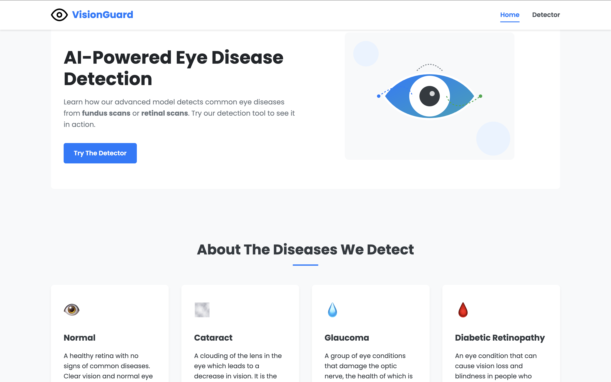
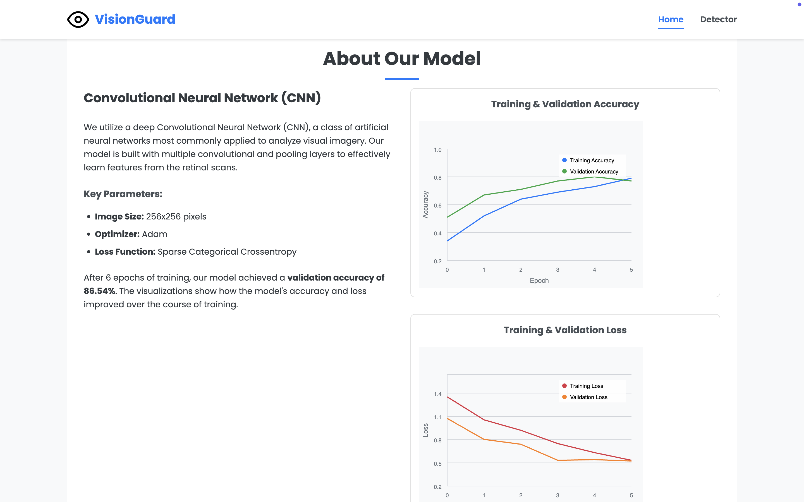
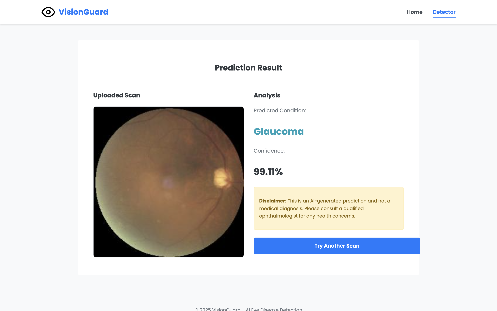

# VisionGuard: AI-Powered Eye Disease Detection 👁️🧠

VisionGuard is a deep learning–based image classification system designed to **detect eye diseases** using retinal images. This AI-powered tool aims to assist ophthalmologists and healthcare professionals by providing **early, fast, and automated** screening of common eye disorders using Convolutional Neural Networks (CNNs).

---

## 📌 Purpose

The primary goal of this project is to:

- Detect common eye diseases from retinal fundus images using AI.
- Help in **early diagnosis** and **reduce the workload** of healthcare providers.
- Provide a lightweight and accessible diagnostic tool that could be used in **remote or under-resourced areas**.

---

## ⚙️ How It Works

1. **Image Input**: A user uploads a retinal (fundus) image.
2. **Preprocessing**: The image is resized, rescaled, and passed through data augmentation layers to improve generalization.
3. **Prediction**: A trained CNN model classifies the image into one of the predefined disease categories.
4. **Output**: The result is displayed with the predicted disease and confidence level.

---

## 🧠 Diseases Covered

The model is trained to detect and classify multiple eye conditions, including:

- **Normal (Healthy)**
- **Diabetic Retinopathy**
- **Glaucoma**
- **Cataract**

(*Update this list according to your dataset classes*)

---

## 🧪 Technologies Used

| Tool/Library         | Purpose                            |
|----------------------|-------------------------------------|
| **Python**           | Core programming language           |
| **TensorFlow/Keras** | Model building and training         |
| **OpenCV / PIL**     | Image loading and manipulation      |
| **NumPy / Pandas**   | Data processing and analysis        |
| **Matplotlib**       | Visualization of data and training  |
| **Jupyter Notebook** | Prototyping and experimentation     |
| **Colab**            | Training using free GPU resources   |
| **Git & GitHub**     | Version control and collaboration   |

---

## 📸 Screenshots

  
  

  
  

